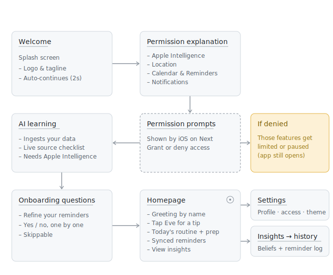

# CH4-AI-Reminder

## 1. Present Your Team
- Amanda
- Caca
- Dani
- Keiko
- Nanda

## 2. Starting Assumption
Going into this project, our primary assumption was that CoreML would be the foundational framework of our entire development stack. We believed that no matter what kind of AI application we designed, CoreML was universally required under the hood to act as the primary pipeline connecting any AI models to native Swift code. This assumption became both the starting point and the first casualty of our exploration — the sections that follow trace how we tested it, dismantled it, and rebuilt our direction around what we actually found.

## 3. The Exploration Log

### What we browsed, and what surprised us:
- CreateML, we notice that we can create and train an ML model with zero code in XCode.
- Apple Intelligence uses powerful foundation models and connects them to the Apple ecosystem so they can understand our personal context.
- As a developer, if we want to use the foundation models that are already built into Apple Intelligence, we don't have to deal with CoreML ourselves.
- The only time we would still need CoreML is if we want to bring our own completely custom or proprietary model (like a specific model we trained ourselves on our own servers) and force it to run locally on the user's iPhone.
- If we are connecting our app to a third-party model running on a remote server (for example, using the OpenAI API, Anthropic API, or our own AWS/Hugging Face cloud server), we don't need CoreML. We can just use standard web networking code (URLSession in Swift) to send text to their server and get a response back.
- Importing Foundation in Swift is completely different from 'Foundation Models' in AI. Foundation Models are large-scale machine learning models trained on broad data to perform varied AI tasks. In contrast, Swift's Foundation is a core software framework that provides essential base capabilities, like data storage, file management, networking, and date formatting, for Apple and Swift development.
- The difference between action classification and activity classification is action for body movements so it needs video as an input meanwhile activity is for motion sensor.
- AVFoundation is an Apple framework used to work with audiovisual media like if we want to play audio files, records video from the camera, inspect media metadata, compresses video files, and handles speech synthesis (text-to-speech).
- AppIntent used to connects app's features to system-wide automation tools like the Shortcuts app, Siri, and Apple Intelligence. It allows us to expose specific actions from our app to the rest of the OS. For example, if we have a journaling app, we can create an AppIntent called "Create New Entry." Apple Intelligence or Siri can then trigger that action even when our app is closed.
- CoreLocation is the GPS and geography engine.
- UserNotification is the push notification manager.
- We can use Playgrounds to test the performance of Foundation Models.

Moving forward, we decided to make the Foundation Models framework our primary area of exploration. It offers a massive amount of untapped potential, and we are eager to discover how its latest updates perform inside the iOS 27 Beta.

### What we actually built or tested in code (not just read about):
- Lakon, a fully offline interactive story game.
- AI Itinerary planner, a localized travel application that generates custom trip plans using native Foundation Models.
- An image-to-text application built using the Google Gemini API for automated captioning.

### What we experienced with on-device Foundation Models (Apple Intelligence):
- Finding specific video clips or photos just by describing a mood, view, or action.
- Understanding personal schedules to surface context-aware, highly relevant reminders.
- Processing spoken requests fluently via an enhanced, conversational Siri.
- Snapping a picture of ingredients to instantly get a step-by-step recipe.
- Recognizing and interacting with text or pages within a physical book.
- Instantly stitching together photos and videos into a short "Memory Movie" based on a prompt.
- Creating custom, mood-based music playlists tailored to a specific ambiance or setting.

### What we discovered that we didn't expect:
- Media search is precise but subjective. It’s amazing at pinpointing specific durations and actions inside a video. However, abstract vibes like "moody" or "cinematic" are hit-or-miss and often require rewording the prompt due to varying human definitions of those moods.
- The models excel at analyzing personal schedules to deliver highly relevant and intelligent daily activity suggestions.
- While Siri is significantly improved, it still struggles with background noise isolation and precise word recognition, sometimes taking a few tries to understand our exact request. **Why this mattered for our final decision:** it told us we could not treat voice as the primary way users feed context to the assistant. A reminder app that depends on flawless voice capture would fail exactly when users are on the move (noisy streets, transit, multitasking). This pushed us toward passive, ambient signals (calendar and location) plus lightweight tap-based feedback, rather than conversational voice input.
- The visual recognition is spot-on for identifying ingredients, but the recipe generation can lose track of quantity (e.g., calling for two eggs when the photo only had one).
- We were impressed that it can pinpoint the exact title of a book based on a single photo of one random page.
- Making short videos from text prompts works, but expect a noticeable rendering lag if you are feeding it with a large amount of media or complex prompts.
- Apple Intelligence doesn't synthesize original music. We expected that an emotional, ambient-audio prompt — our actual test was *"The chatter nearby is making me anxious."* — might let the model generate a novel, calming soundscape on-device. Instead, on the first attempt it retrieved an existing matching playlist from Apple Music, and on a later attempt it simply fell back to Apple’s built-in, static background sounds — never once creating anything new. This exposed a clear boundary of the on-device model: it *retrieves and matches* existing content rather than *generating* original creative media. **Why this mattered for our final decision:** it warned us not to build features that assume generative media output. We chose to lean on what the model is genuinely reliable at — reasoning over personal context and producing structured, factual output — instead of expecting creative generation it cannot deliver consistently.
- We can define both a user-facing `prompt` and a system-level `instruction` in code. System instructions allow us to anchor the foundation model to specific rules, roles, or constraints, ensuring relevant outputs even when user input varies wildly.
- We utilized a `switch` statement to robustly handle different model availability states (e.g., checking if the model is fully downloaded, restricted, or currently unavailable on the device).
- To enforce a neat, predictable data structure from the model, we annotated our Swift models with `@Generable`. We then used the `@Guide` macro on individual properties to give the model precise, inline context about what each data field represents.
- We discovered we can dramatically improve model accuracy using standard Swift syntax. We can inject native logic like `if` statements and loops for structured engineering, or pass mock object instances directly into the prompt to act as few-shot examples for the model to mirror.
- To prevent the UI from freezing while waiting for a full response, we can implement the streaming API using `streamResponse`. By tagging properties with `PartiallyGenerated`, the UI can display the output word-by-word as it streams, creating a much more engaging user experience.
- We can expand the model's reach by implementing Tools. These are standard Swift functions exposed to the foundation model, allowing it to autonomously fetch real-time external data or execute local app actions when needed.
- We can implement two critical techniques to minimize response lag:
  * Calling `prewarmModel()` inside a view task modifier to load the model into memory before the user requests it.
  * Setting `includeSchemaInPrompt: false` inside the `session.streamResponse` call to reduce token overhead and speed up processing times.

### Connecting the dots — the dealbreakers that shaped our decision:
Most of the observations above were interesting, but only a few were truly decisive. Three findings became genuine dealbreakers that everything after this point hinges on:
1. **The model reasons and retrieves far better than it generates creative media.** The music and short-video experiments showed it matching or lagging rather than inventing, which ruled out our media-generation concepts.
2. **Structured, factual, schedule-based tasks were consistently strong, while subjective "vibe" prompts were unreliable.** This steered us away from an art/creative tool and toward a practical, everyday utility.
3. **Voice input looked too fragile to be a primary channel.** We did not build our own voice feature to test this — the signal came from hands-on use of Siri, whose recognition still stumbled on background noise and exact wording. We treated that as a caution rather than proof, and it steered us toward passive, ambient data (calendar and location) with lightweight tap feedback instead of conversation.

These three dealbreakers are the throughline of this report: they explain the concepts we dropped (Section 4), the hard limits we hit (Section 5), and the app we ultimately committed to (Section 6).

## 4. What We Tried and Dropped
- We originally designed a conceptual AI video editor capable of identifying specific scenes, emotions, or highlight-worthy moments to automatically curate long-form footage into short, meaningful clips using a stack of **Foundation Models, AVFoundation, and AppIntents**. We pivoted away from this concept because native Apple Intelligence features (such as Memory Movies and advanced Photos search) already handle this behavior. Furthermore, testing revealed that foundation models still struggle with highly subjective emotional prompts (like "moody" or "cinematic") due to the variance in human interpretation.
- We explored an automated journaling application that could process a user's prompt, pull matching media assets, and generate descriptive text into a digital scrapbook layout. We shelved this idea for two reasons: a competitive audit showed an over-saturation of AI journaling concepts since our initial stage, and the core value proposition of a scrapbook relies heavily on visual layout and scrapbook design, whereas this challenge strictly tasked us with exploring deep technical implementation of frameworks.
- We built **Lakon**, a fully offline interactive story game, purely as a hands-on experiment rather than a product candidate. Our goal was simply to have fun while probing how the Foundation Model behaves when it has to drive an open-ended, branching narrative — how creative it gets, whether it stays consistent and in-character across a long story, and where it starts to drift. It served that purpose well: it taught us a lot about the model's generative and multi-turn storytelling behavior. But we dropped it as a final direction because it was always a learning playground, not a real-world need, and its game-first, entertainment concept didn't align with this challenge's focus on a practical, framework-driven application.

## 5. Real Limitations Hit
If Section 4 covered the ideas we chose to walk away from, this section covers the limits the technology imposed on us regardless of our choices — the hard walls that confirmed the dealbreakers above.

We attempted to use the Foundation Models framework combined with `AVFoundation` to build an AI assistant video editor that could extract highlights based on emotional moods (like "sad," "cinematic," or "moody"). While the documentation states that the model excels at isolating actions and precise timestamps, it repeatedly struggled with these abstract requests. Because human definitions of a "vibe" vary, the model failed to return consistent, reliable results for subjective keywords. We dropped the dedicated app concept when we realized native Apple Intelligence features (like Memory Movies and advanced Photos search) already handle this behavior.

Besides that, we also notice that Foundation models can't solve a complex reasoning, long-context tasks, general world knowledge, code generation, and math. To maximize and isolate the true potential of Apple's Foundation Models framework, we made a deliberate architectural decision not to introduce or implement any external third-party models or cloud AI runtimes.

Once we moved from research into an actual working build, several new realities surfaced that we hadn't fully anticipated during the exploration phase.
- The model still hallucinates. Even with a fully native pipeline, it occasionally produces a reminder that doesn't match the context it was given (surfacing the wrong action). When we debugged these cases, we traced the likely causes to three layers:
  * Prompt quality (developer side): vague, under-specified, or poorly structured prompts leave too much room for the model to guess.
  * Context data available to the model: when the insight data we feed it is thin or ambiguous, the model fills the gaps with fabrications.
  * Quality of the processed data: noisy, inconsistent, or poorly formatted input data degrades the reliability of the output.
- Language support is narrower than expected. The Foundation Model does not reliably process every language. For non-English input, we effectively need a `Natural Language` framework as a translation step to convert the text into English before the model can reason over it, because several languages simply don't work well (or at all) with the on-device model yet.
- The model has no long-term memory. The Foundation Model can't continuously remember or persist user data on its own. It is effectively stateless between calls.

## 6. The Revised Decision

### Final decision:
We are building an AI-powered Adaptive Reminder Assistant that leverages a native framework pipeline consisting of **Foundation Models + Natural Language + EventKit + CoreLocation + UserNotifications + SwiftData.** The application is designed to passively learn user schedules, routines, and physical habits over time, delivering hyper-contextual, non-intrusive reminders that dynamically adapt based on real-world environment variables, behavioral cues, and lightweight, active user feedback loops.

### Main use case:
EVE targets *micro-habits* — small, easily-forgotten actions whose value depends entirely on the right moment and context, such as taking medication, refilling a water bottle, charging a device, or picking up groceries on the way home. A concrete walkthrough of how EVE ideally works: from your calendar and location patterns, EVE learns that you usually leave the office around 6 PM on weekdays and that "buy groceries" is a task you tend to forget. Rather than firing a fixed daily alarm, it waits until you actually start heading home and then delivers a context-aware nudge — *"You're leaving work and you're low on groceries. Want to stop by the store on the way?"* If you dismiss or act on it, EVE folds that response back into its understanding, so the next reminder is better timed and less intrusive. The core loop is always the same: **learn the routine → detect the right moment → deliver an adaptive nudge → learn from the response.**

It is worth being honest about a precondition: this ideal walkthrough only holds when EVE has sufficiently rich, high-level context to reason over — reasonably detailed calendar entries, a captured "buy groceries" task, and enough location history to recognize the "leaving work" moment. When that context is thin, EVE degrades to simpler, less situational reminders (see the graceful-degradation strategy under *About privacy*). The quality of the nudge is directly bounded by the quality and richness of the data it is given.

### User flow:
The diagram below reflects the current build. A brief Welcome splash leads into the permission explanation; tapping *Next* fires the iOS system permission prompts (denying them limits or pauses the affected features rather than blocking the app). EVE then runs its on-device learning pass, asks a few skippable questions to refine its understanding, and lands on the Homepage — from which the user can reach Settings and the Insights/History views.

### What changed since Section 1, and why:
Our core strategy completely pivoted to embrace an exclusive native architecture. While our initial ideations relied on heavy, design-dependent applications or complex multi-model pipelines, we discovered that the true potential of Apple's Foundation Models framework is best unlocked when it operates completely on its own, natively on-device. We explicitly dropped alternative ideas (like the AI video editor and automated scrapbook) because they either duplicated built-in Apple features or over-indexed on UI layout over deep technical experimentation. By focusing on a smart context assistant, we harness the baseline strengths of Apple Intelligence: zero-latency local execution, complete on-device privacy, and direct integration with the operating system.

During development, we decided to incorporate the **Natural Language** framework as an additional core framework. We found that the on-device Foundation Model currently has limited support for some non-English languages. By using the Natural Language framework to detect and translate non-English user input into English before passing it to the Foundation Model, we ensure that the model can reason over the input more accurately and consistently across different languages.

We also discovered an important limitation of the on-device Foundation Model: it is stateless, meaning it cannot continuously remember or persist user information across interactions. Rather than relying on the model to retain the user's history, we store the assistant's learned understanding as AI Insights in **SwiftData**. The Foundation Model is invoked only when needed, and each time it runs, it reasons over the persisted insights and current context instead of relying on memory from previous sessions. In other words, the Foundation Model provides the reasoning, while SwiftData serves as the long-term memory.

## App Track Addendum
### About the frameworks
Our use case absolutely mandates the strict collaboration of all these frameworks. The application could not function with the main Foundation Models framework alone. While the Foundation Model acts as the core "brain" for reasoning and personalization, it is completely isolated from the device's hardware, operating system data, and user interface. It lacks the native capability to fetch live data, track physical locations, or trigger system alerts on its own.

The secondary frameworks serve as the essential eyes, ears, and hands for the AI model:
- EventKit: This framework is required to sync directly with Apple’s native Calendar and Reminders applications. It extracts the historical and upcoming timeline data that the Foundation Model analyzes to map, predict, and understand the user's initial routine patterns.
- CoreLocation: Acts as the sensory trigger, feeding real-time geographical coordinates to the app so the model can determine when a user has arrived at a relevant destination.
- UserNotifications: Because the core utility of an adaptive assistant relies entirely on timely engagement, this framework is critical. UserNotifications is the primary channel used to deliver the final adaptive reminders and request lightweight clarification prompts when the user is on the move.

### About accessibility and localization
For most of this challenge we deliberately did not design around a specific user. The brief was about exploring and stress-testing frameworks, not serving a target market, so our attention stayed on what the technology could and couldn't do rather than on who would use it. It was only after we committed to the adaptive reminder concept that a natural audience revealed itself. Because the entire value of the app is remembering small, time- and context-sensitive tasks *for* the user and nudging them at exactly the right moment with minimal effort, we realized it maps almost perfectly onto the everyday struggles of people with ADHD or executive dysfunction — difficulty with prospective memory (remembering to do a thing later), task initiation, and shifting attention at the right time. In other words, our target user was not an upfront assumption; it emerged from the shape of the solution. That is why we chose people with ADHD as our primary audience — and, once we did, it sharpened every design and framework decision that followed.

As described in our main use case (Section 6), EVE is built around these micro-habits. Because their success depends on prospective memory and precise timing, standard fixed and repetitive reminders tend to fail exactly the users who need them most. Instead, EVE delivers adaptive reminders based on the user's current context, reducing the cognitive effort required to remember these small but essential routines.

Because users with executive dysfunction can also experience cognitive overload when interacting with digital products, we intentionally designed EVE to minimize the effort required to use the app itself. Our design principles are:
- Dark interface as an accessibility feature, giving users the option to reduce visual stimulation and improve comfort in low-light environments.
- We minimize on-screen clutter and surface a single, clear primary action per screen, cutting the decision fatigue and task paralysis that often stall ADHD users.
- Feedback loops are lightweight and tap-based rather than typing-heavy, so responding to the app never feels like a chore.

We do not support entirely disengaged users who use neither Apple's native Calendar/Reminders apps nor participate in our questionnaires. Without passive EventKit telemetry or active feedback, the Foundation Model hits a "blank slate" constraint and cannot personalize routines.

The application will be natively developed and fully supported in English. As a direct consequence of the language limitation above, we reversed our earlier plan to localize into Bahasa Indonesia. The Foundation Model doesn't yet work reliably in Indonesian, so shipping an Indonesian experience would mean shipping a broken AI core. For now the app stays English-only, and Indonesian localization is deferred until on-device language support matures.

### About privacy
Because we use Apple’s native Foundation Models framework, all data processing happens strictly on-device. We require three data channels:
- Calendar & Reminder (`EventKit`): To analyze historical schedules and map the user's baseline routine.
- GPS (`CoreLocation`): To detect real-world arrivals and departures for location-based prompts.
- `UserNotifications`: To deliver adaptive reminders and collect lightweight questionnaire feedback.

The app uses a graceful degradation strategy to keep functioning under system constraints:
- If `EventKit` is Denied: The model loses passive timeline data and switches to an active-learning mode, building the user’s routine profile solely through notification questions.
- If `CoreLocation` is Denied: Geographic triggers are disabled. The model automatically recalculates schedules using purely time-based constraints (e.g., "30 minutes after waking up").
- If `UserNotifications` is Denied: All lock-screen engagement is blocked. The app falls back to an in-app dashboard experience, requiring the user to open the app manually to view their queued reminders and feedback questions.
- If All Permissions Are Denied: The model hits a hard constraint. With zero telemetry or delivery channels, the app halts and displays an onboarding screen explaining that the AI needs at least one data source to begin tracking routines.
